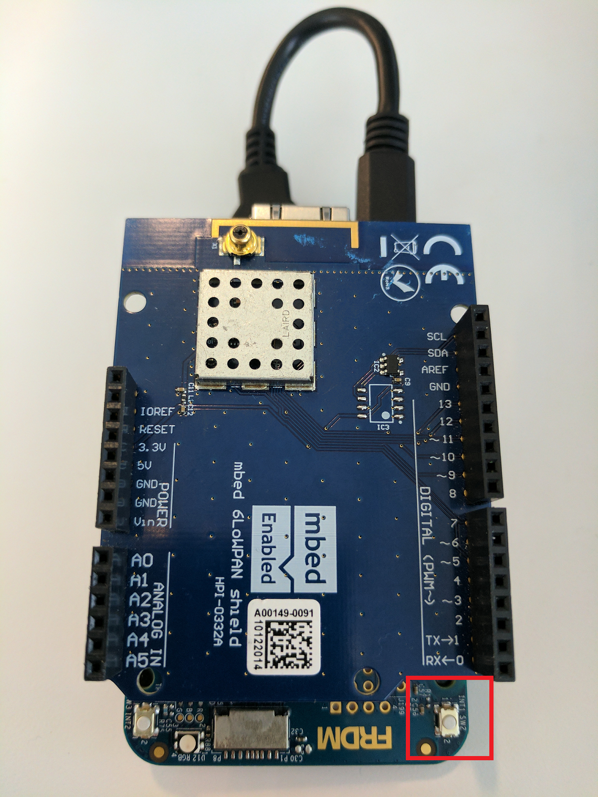

# Developer's Guide for a Wireless Game

The goal of this project was to create something fun and interesting which utilizes a variety of different hardware sensors and components. Along with that, I wanted to give readers example code which utilizes current technologies like mesh networks, microcontroller displays, and accelerometers, with intention that you yourself can go off and do amazing things with the technology. This technology is not relatively cheap (as least not yet), but is suited and well equipped for real-time home and industrial applications.

In this project, I put a twist on a classic arcade game utilizing Arm Mbed [devices](https://developer.mbed.org/platforms/) and [components](https://developer.mbed.org/components/). I also included some stripped down sample code for the drivers and libraries, to assist you in getting the hardware working in any other project you may have.

To see the project in action, check out the accompanying video [here](TODO: insert youtube link).

## Project overview


In this project, there are three different microcontrollers consisting of a master and two slaves. The master is responsible for bringing up the mesh network, assigning IP addresses to its slaves, and updating the game screen. The slave devices are issued out to game players, and are used like ping-pong paddles.

When a player raises and lowers their paddles, the slave device's accelerometer data is transmitted to the master, and the master will update the player's paddle location on the screen based on that data. The players try to get as many points as possible by sending the ping-pong ball into the other player's goal. Once the max score is reached, a winner is determined and the game ends.


The devices in this project communicate with each other using a newer 2.4GHz wireless protocol named [Thread](http://threadgroup.org/What-is-Thread/Connected-Home), which has recently become an industry standard and is backed by an alliance of big name companies. For more information of Thread, an introduction is found [here](https://docs.mbed.com/docs/arm-ipv66lowpan-stack/en/latest/thread_intro/).

## Requirements
In order to build this project, you will need the following items:
* [FRDM-K64F](https://developer.mbed.org/platforms/FRDM-K64F/) (x3).
* [6LoWPAN shield](TODO: update with components page link when available) (x3).
* [ST7735 LCD display](https://www.adafruit.com/product/358).
* [Male header pins](https://www.adafruit.com/product/392).
* [Female/Female jumper wires](https://www.adafruit.com/product/1950).
* [Male/Male jumper wires](https://www.adafruit.com/product/1956).
* Soldering Iron and solder.

Optional items to make devices battery powered:
* [PowerBoost 500 charger](https://www.adafruit.com/product/1944) (x3).
* [LiPo battery](https://www.adafruit.com/product/1578) (x3).
* [6in USB cable](https://www.adafruit.com/product/898) (x3).

## Master device hardware
The master device requires use of two different SPI module blocks found on the FRDM-K64F.  The first SPI block is consumed by the 6LowPAN shield, which provides the Thread mesh network. The second SPI block us used by the ST7735 LCD screen. This section is divided up into three sub-sections. They will explain how to solder necessary headers to the board, connect the screen to the device, and attach the 6LoWPAN shield for mesh networking.

### Soldering an additional header to the master device
The second SPI block is not initially pined out on any header of the FRDM-K64F. Therefore, an additional header needs to be soldered to the board. The location of when the header needs to be soldered is shown in the image below.


Now, prepare some male pin headers into a 2x4 configuration. Below is what they should look like.


Below is what the device should look like after soldering the pins to the board.


The pin numbers and pin names for this new header is provided below. The numbers in this image corrispond to the numbers printed on the board's silkscreen next to the header.


### Connecting the screen to the master device
Now with these additional SPI pins available, you can connect the ST7735 LCD screen to them with jumper wires!


The pinout table below shows how you should connect the ST7735 LCD to the FRDM-K64F. Note that the 2x4 header that you soldered onto the FRDM-K64F only has one Gnd pin, and no +3.3V pins. The remaining Gnd and +3.3V pins that are required can come from any other acceptable power/gnd pin found on the FRDM-K64F.

| ST7735 LCD pin | FRDM-K64F pin |
| :------------- |:------------- |
| LITE           | +3.3V         |
| MISO           | PTD7          |
| SCK            | PTD5          |
| MOSI           | PTD6          |
| TFT_CS         | PTD4          |
| CARD_CS        | Unconnected   |
| D/C            | PTC18         |
| RESET          | +3.3V         |
| VCC            | +3.3V         |
| Gnd            | Gnd           |

### Connecting 6LoWPAN shield to master device
After the screen is fully connected to the board, the last step for the master deive is to connect the 6LoWPAN shield to the FRDM-K64F. The 6LoWPAN shields have Arduino R3 headers, and should connect easily to the FRDM-K64F. The master device will now look something similar to the first image in this document.

## Slave device hardware
The only hardware needed for the slave devices are two FRDM-K64F microcontrollers and two 6LowPAN Shields. Simply attach the 6LoWPAN shields to the headers of the FRDM-K64F. The 6LoWPAN shields have Arduino R3 headers, and should connect easily to the FRDM-K64F.

## Battery power hardware (optional step)
I recommend powering the devices via batteries so that they are untethered during play. This makes playing the ping-pong game a more authentic experience. Below is an image of how I connected the PowerBoost 500 charger and LiPo battery to the FRDM-K64F devices. I simply placed the LiPo battery flat against the FRDM-K64F's backside, put the PowerBoost 500 charger on top of that, and then zip tied them together. The PowerBoost 500 chargers are awesome, as they can charge your LiPos and provide a steady +5V for the FRDM-K64F. Feel free to get creative here!  


## Software setup
Clone the repository onto your computer. Make sure mbed CLI is installed with the requirements as shown in this [video](https://www.youtube.com/watch?v=PI1Kq9RSN_Y&t=2s).

The directory structure of this repo, along with a description of each of the different directories is below:
* display - Sample code, drivers, and libraries for the ST7735 display.
* images - Images that are used within this README.
* master - Code that gets flashed to the master device.
* motion - Sample code, drivers, and libraries for the accelerometer.
* slave - Code that gets flased to the slave devices.

You will need to compile the code for both the master and slave devices.  To compile code for both of these device, run the following commands from the root directory of this repo:

```
cd master
mbed compile -m K64F -t GCC_ARM
cd ../slave
mbed compile -m K64F -t GCC_ARM
```

Once all the files are compiled, you can then drag and drop the resulting binaries (.bin file) onto the respective master and slave devices.

## Running the game
After the master and slave devices have been flashed, you can now power them up.  All three devices should startup with the FRDM-K64F's on-board LED blinking red. The red LED represents that the boards are waiting for an IP address. The master device will be the first to acquire an IP address, and will cause the LED to blink green. After the master has an IP address, it will assign IP addresses to its slave devices, resulting in a green LED on the slave devices as well.

When all the devices have a blinking green LED, the mesh network is now configured properly. Next, it is time to pair the players to their paddles. Have Player1 press the user button found in the red rectangle in the image below.  This same user button will be used to serve the ping-pong ball later in the game.



After Player1 presses the user button, the screen on the master device should update saying that Player1 has been paired. Player2 should then press their user button as well to finish pairing. Once both players have paired their paddles, the game is ready to begin.  Any player can now press the user button found on the master device to start the game.

When the game starts, Player1's paddle will be on the left side of the screen, and Player2's paddle will be on the right.
