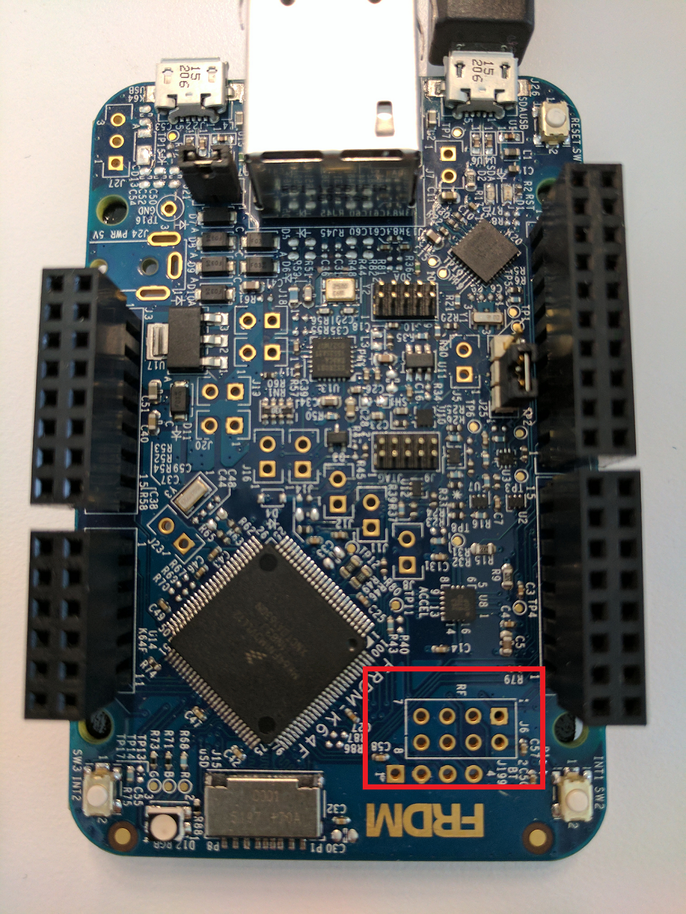
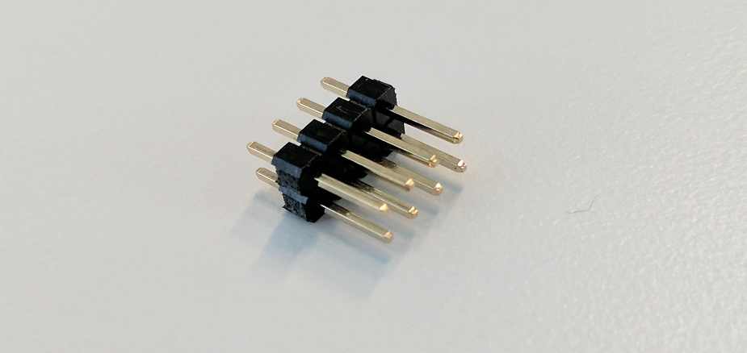
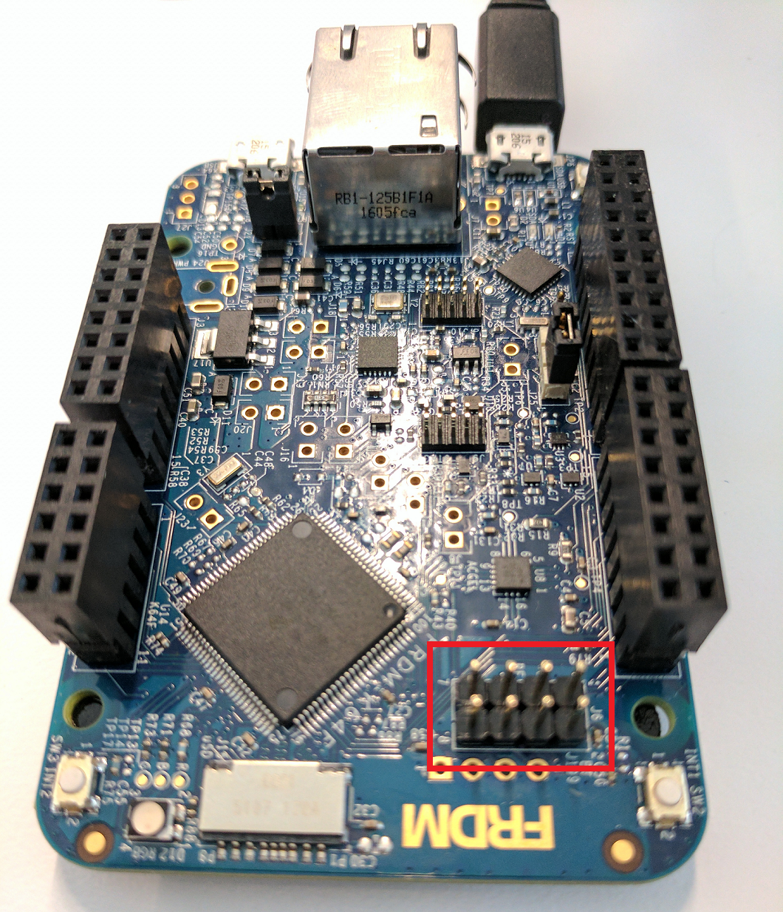

# Developer's Guide for a Wireless Game

The goal of this projects was to create a fun and interesting project which utilized a variety of different hardware sensors and components. Along with that, I wanted to give readers example code which utilizes current technologies like mesh networks, microcontroller displays, and accelerometers, with intention that you yourself can go off and do amazing things with the technology. In this project, I put a twist on a classic arcade game utilizing Arm Mbed [devices](https://developer.mbed.org/platforms/) and [components](https://developer.mbed.org/components/), and hope that you have as much fun as I did building something similar. To see the project in action, check out the accompanying video [here](TODO: insert youtube link).

## Project overview

In this project, there are three different microcontrollers (a master and two slaves). The master is responsible for bringing up the mesh network, assigning IP addresses to its slaves, and updating the game screen. The slave devices are issued out to game players, and are used like ping-pong paddles. When a player raises and lowers their paddles, the slave device's accelerometer data is transmitted to the master, and the master will update the player's paddle location on the screen based on that data. The players try to get as many points as possible by sending the ping-pong ball into the other player's goal. Once the max score is reached, a winner is determined and the game ends.

The devices in this project communicate with each other using a newer 2.4GHz wireless protocol named [Thread](http://threadgroup.org/What-is-Thread/Connected-Home), which has recently become an industry standard and is backed by an alliance of big name companies. For more information of Thread, an introduction is found [here](https://docs.mbed.com/docs/arm-ipv66lowpan-stack/en/latest/thread_intro/).

## Requirements
In order to build this project, you will need the following:
* [FRDM-K64F](https://developer.mbed.org/platforms/FRDM-K64F/) (x3).
* [6LoWPAN shield](TODO: update with components page link when available) (x3).
* [ST7735 LCD display](https://www.adafruit.com/product/358).
* [Male header pins](https://www.adafruit.com/product/2076).
* [Female/Female jumper wires](https://www.adafruit.com/product/1950).
* [Male/Male jumper wires](https://www.adafruit.com/product/1956).
* Soldering Iron and solder.

Optional items to make devices battery powered:
* [PowerBoost 500 charger](https://www.adafruit.com/product/1944) (x3).
* [LiPo battery](https://www.adafruit.com/product/1578) (x3).
* [6in USB cable](https://www.adafruit.com/product/898) (x3).

## Hardware setup
In this section, I will explain all the necessary hardware connections that are needed to get the project running. First, I will go over how to build the master device, followed by setting up its two slave devices. If you decide to power the project with batteries, there is the optional final step here which will instruct you how to do so.

### Master device
The master device requires use of two different SPI module blocks found on the FRDM-K64F.  The first block is consumed by the 6LowPAN shield, which provides the Thread mesh network.  The ST7735 screen will use the second module block. The second SPI module block is accessed by soldering male pin headers onto the FRDM-K64F at the location marked in red in the image below.

This is what the 2x4 male pin headers should look like.

And this is what the device should look like after soldering the pins to the board.

### Slave devices
The only hardware needed for the slave devices is two FRDM-K64F microcontrollers and two 6LowPAN Shields. Simply attach the 6LoWPAN shields to the headers of the FRDM-K64F. The 6LoWPAN shields have Arduino R3 headers, and should connect easily to the FRDM-K64F.

### Battery powered devices (optional)

## Software setup
Clone the repository onto your computer. Make sure mbed CLI is installed with the requirements as shown in this [video](https://www.youtube.com/watch?v=PI1Kq9RSN_Y&t=2s).
